# Lextract

**Commercial lease abstraction.** Upload a lease PDF, get 126 structured fields back: every one with
a confidence score, a citation to the source text, and a red-flag review of the terms that cost
tenants money.

> [!IMPORTANT]
> **Status: retired.** Lextract ran in production on Cloudflare; lextract.io no longer serves it.
> This repository is published as the engineering record of what was built, read here in the past
> tense.

A paralegal doing this by hand takes three to six hours. Lextract's published processing time was
five to fifteen minutes. Both figures are the product's own: the manual estimate is in
[`frontend/data/workflows.ts`](frontend/data/workflows.ts), the processing time on the marketing
pages. Neither is measured anywhere in this repository, so read them as what was claimed rather
than as a benchmark.

Designed, built and run solo by **[Angel Campa](https://github.com/AngelCampa1)**.

> [!NOTE]
> **Source available, not open source.** Published so you can read it. See [LICENSE](LICENSE).
>
> This is a snapshot of the working repository, not its development history.

<picture>
  <source media="(prefers-color-scheme: dark)" srcset="portfolio/screenshots/results-split-view-dark.png">
  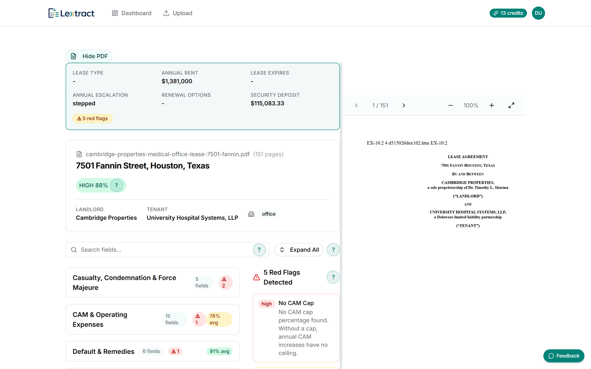
</picture>

*The review UI: the source lease on the right, the extracted fields on the left, a confidence score
on the lease and on each category, and the red flags the terms produced. The three dashes in the
summary bar are not a rendering failure: no value came back for those fields, and
[`exec-summary-card.tsx`](frontend/components/results/exec-summary-card.tsx) renders every unknown
as `-` rather than inventing one. A field with no value is scored `not_found` and dropped from the
confidence denominator, which is why the lease still reads HIGH 88%.*

→ [portfolio/USER-FLOWS.md](portfolio/USER-FLOWS.md) walks this screen and four others step by step
· [portfolio/PRD.md](portfolio/PRD.md) is where the 126 fields and 20 red-flag rules were specified

**The part worth reading is that the backend was thrown away once.** v1 was FastAPI, Celery and
Redis on Railway. v2 is Cloudflare Workers, Workflows and Queues, ported in a single day by coding
agents working against a 1,091-line written plan. The port cost real safeguards (an adversarial
second pass, a dual-extract judge, prompt-injection defence), and the more sophisticated design it
replaced is still sitting unported in `packages/extract-sdk/`. Both versions are in this repository,
so you can read [the trade](#the-rewrite-python-to-cloudflare-native-and-what-it-cost) instead of
taking my word for it.

---

## Contents

- [If you read one thing](#if-you-read-one-thing)
- [What it did](#what-it-did)
- [Architecture](#architecture)
- [The rewrite: Python to Cloudflare-native, and what it cost](#the-rewrite-python-to-cloudflare-native-and-what-it-cost)
- [How extraction works](#how-extraction-works)
  - [The design that did not ship](#the-design-that-did-not-ship)
- [Correctness under money and concurrency](#correctness-under-money-and-concurrency)
- [By the numbers](#by-the-numbers)
- [Testing](#testing)
- [Screenshots](#screenshots)
- [Repository map](#repository-map)
- [Documentation](#documentation)
- [About this snapshot](#about-this-snapshot)
- [Built with AI agents](#built-with-ai-agents)
- [Running it locally](#running-it-locally)

---

## If you read one thing

**Five minutes:** [the rewrite](#the-rewrite-python-to-cloudflare-native-and-what-it-cost) and
[correctness under money and concurrency](#correctness-under-money-and-concurrency). **Thirty:** add
[how extraction works](#how-extraction-works) and
[testing](#testing). **Actually running it:**
[running it locally](#running-it-locally).

---

## What it did

Lextract took a commercial lease PDF and returned 126 structured fields across 16 categories
(parties, dates, rent and escalations, CAM and operating expenses, options, insurance, default and
remedies, and more), each with a confidence score, a citation to the source text, and a red-flag
review of 20 rule-based checks (`RF-001` to `RF-020`) for terms that tend to cost tenants money:
uncapped management fees, missing audit rights, no CAM cap, short cure periods.

The flow was upload-first: a visitor could drop a PDF in with no account, watch it extract, and see
a five-field teaser before paying $15 (or buying a 5- or 10-lease credit pack) to unlock the full
result, edit any field inline, and export it as Word, PDF or Excel. It also functioned as a
deliberately low-priced acquisition funnel (`portfolio/PRD.md` §1.5) into a second product,
CamAudit, which the CAM-relevant red flags routed toward. CamAudit is retired too.

It ran in production first on a Python/Celery/Railway backend, then, after the June 2026 rewrite
below, on Cloudflare Workers, until the product was retired. No launch date, usage figures, or
revenue figures survive in this repository. What survives is the code, the schema, and the test
suite, which is what the rest of this document is about.

---

## Architecture

Production was entirely Cloudflare-native. There was no container, no VM, and no always-on process
anywhere in the request path. The diagram below is what ran until the service was retired; the
Workers and domains in it no longer exist.

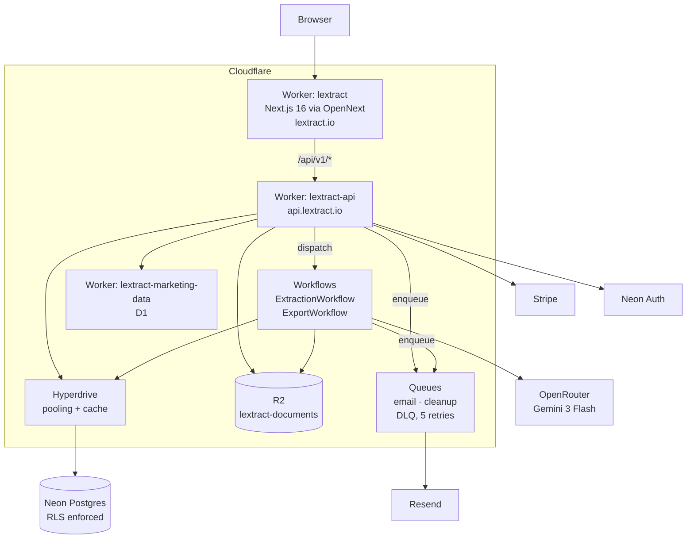

**Why this shape.** Extraction takes minutes and calls an unreliable third party, so it cannot live
in a request. Cloudflare Workflows gives durable execution with per-step retries and no worker
process to keep alive. Hyperdrive solves the problem that killed the first architecture: serverless
functions and Postgres connection limits do not mix, and Hyperdrive pools on Cloudflare's side.

| Layer | Choice |
| --- | --- |
| Frontend | Next.js 16, React 19, TypeScript strict, Tailwind 4, shadcn/Radix, TanStack Query |
| API | TypeScript on Cloudflare Workers, Zod at the boundary |
| Extraction | `packages/extract-core`: pure domain logic, zero Worker bindings |
| Database | Neon Postgres via Hyperdrive, row-level security on every table |
| Storage | R2 bucket binding (no egress fees) |
| Async | Cloudflare Workflows (extraction, export) and Queues (email, cleanup) |
| Model | Gemini 3 Flash via OpenRouter, native PDF input |
| Payments | Stripe Checkout |

→ [portfolio/ARCHITECTURE.md](portfolio/ARCHITECTURE.md) is the full map: every table, every route,
every binding · [portfolio/DEPLOYMENT.md](portfolio/DEPLOYMENT.md) is the runbook that put it there

---

## The rewrite: Python to Cloudflare-native, and what it cost

The first version was FastAPI + Celery + Redis on Railway, with Postgres and a Python extraction
SDK. It worked. It also cost money every hour of every day to sit idle, and the traffic was bursty
by nature: a lease arrived, minutes of work happened, then nothing for hours.

On **2026-06-12** the entire backend was replaced in a single day: 29 commits in the development
repository, planned in advance in
[`docs/superpowers/plans/2026-06-12-cloudflare-native-backend.md`](docs/superpowers/plans/2026-06-12-cloudflare-native-backend.md)
(1,091 lines).

The work was executed by coding agents against that plan, which is why it fit in a day and why the
plan runs 1,091 lines: the design standards below had to be enforceable by an executor that would
not use judgement to fill a gap. The plan opens by naming the sub-skill the agents were required to
run it under, so nothing about this is reconstructed after the fact.

**What it cost:** the extraction orchestrator was rebuilt simpler than the Python one and several of
its safeguards did not come across. The better design is still in the repository, unported, so both
are readable side by side. That is spelled out under
[the design that did not ship](#the-design-that-did-not-ship) rather than glossed.

What made the port survivable:

- **A written plan with non-negotiable design standards, agreed before any code.** Routes parse and
  delegate, nothing else. SQL lives only in repositories. State transitions go through one module.
  R2 key construction goes through one module. Every external API sits behind an adapter.
- **Domain logic was ported to a package with no Worker bindings at all.** `packages/extract-core`
  knows nothing about Cloudflare and is testable in plain Vitest. The Worker is a thin shell around
  it.
- **The API contract was frozen.** The new Worker had to serve the existing `/api/v1/*` surface on
  the same hostname so the frontend needed no changes. Tests were written to prove contract
  compatibility, not just unit behaviour.
- **The Celery chain became a Workflow.**
  `run_gemini_extraction → score_confidence → run_red_flags → mark_complete` mapped onto durable
  workflow steps, which removed the broker, the worker process, and the "task acked but died"
  failure mode along with them.

The Python is still in the repository. It is the honest before-picture, it holds 2,136 of the tests,
and `backend/neon/migrations/` remains the canonical schema. It was never deployed after the
cutover.

---

## How extraction works

**There is no OCR step.** The PDF is sent to the model as base64 multimodal input. Scanned leases,
native PDFs and rotated pages all take the same path, and the model sees the page layout, which
matters, because a rent table means nothing once it has been flattened into a line of text.

### The durable pipeline

[`workers/api/src/workflows/extraction-workflow.ts`](workers/api/src/workflows/extraction-workflow.ts):
each `step.do()` is a retry boundary. A failure re-runs that step, not the whole extraction, so a
transient OpenRouter error never costs a second full-document inference.

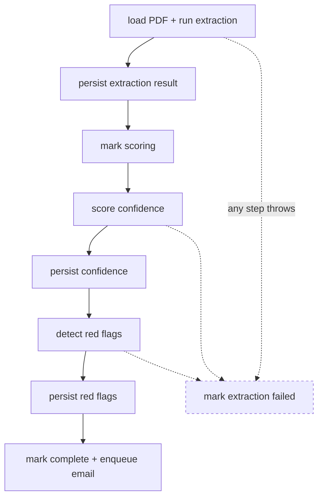

The compensating step catches a throw from any of the eight, not just the three drawn.

### Multi-pass extraction, as it actually ships

A single model call on a 90-page lease gets the easy fields right and quietly invents the hard ones.
What ran in production was a deliberately plain answer to that: run the extraction twice, merge, and
spend a third call only on the fields that came back weak. It lives in
[`packages/extract-core/src/extraction/orchestrator.ts`](packages/extract-core/src/extraction/orchestrator.ts)
(189 lines).

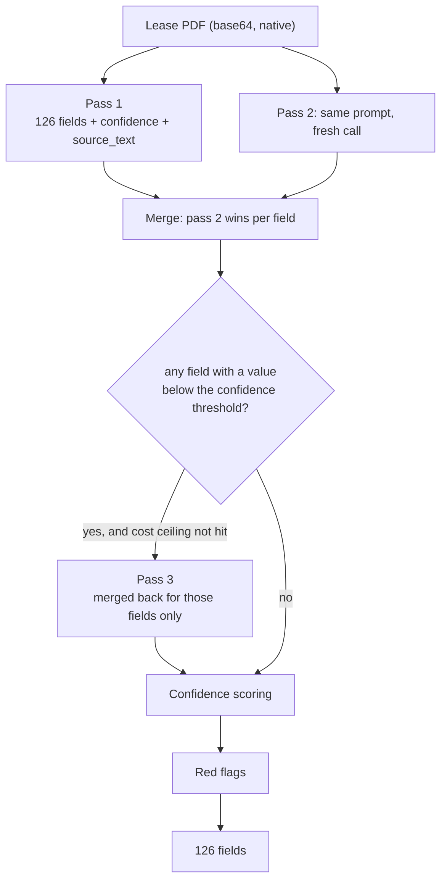

The details that matter:

- **Each pass is a model chain, not a model.** `pass1Models` is a list; the orchestrator walks it
  and the first success wins, recording a failed `passRecord` for each model it burned through. A
  provider outage degrades to the fallback instead of failing the extraction.
- **Pass 3 is gated on both signal and budget.** It fires only when a field has a non-null value
  scoring below `EXTRACTION_ESCALATION_THRESHOLD` (0.6 by default) *and* accumulated spend is under
  `OPENROUTER_COST_CEILING_CENTS` (300 by default). Its output is filtered to exactly those weak
  fields before merging, so a third pass cannot disturb fields that were already confident.
- **Cost is accumulated from OpenRouter's reported spend** on every call and surfaced as
  `costCeilingHit` on the result, so an extraction that ran cheap-and-degraded is distinguishable
  after the fact rather than silently identical to a full one.

By default all three passes use the same model (`google/gemini-3-flash`, falling back to
`gemini-2.5-flash`), so the second pass buys sampling variance rather than a second opinion. Every
slot is env-configurable, and pointing pass 2 at a different model is a config change, not a code
change.

### The design that did not ship

`packages/extract-sdk` (the retired Python stack) contains a considerably more elaborate pipeline
that **never reached production**. It is worth reading precisely because of that gap:

- **Pass 2 prompted as a hostile reviewer,** with the instruction *"find errors in the extraction
  below, not confirm what looks correct,"* returning a sparse patch of corrections with reasoning,
  backed by a ten-item forensic checklist.
- **A dual-extract judge** where the field diff is computed in Python and only genuine disagreements
  are put to a model for arbitration, with verdicts type-checked against a Pydantic model generated
  at runtime from the schema JSON (`bool` excluded from `int` matching in two places, so `true` can
  never become `1.0` on a rent field).
- **A hand-maintained per-model pricing table**, where the cost ceiling skips any model it cannot
  price rather than defaulting it to zero.
- **572 lines of commercial-real-estate domain knowledge:** BOMA load factors, the six distinct
  lease date types, cumulative versus non-cumulative CAM caps.
- **Prompt-injection defence in the system prompt.** The lease is adversary-supplied input, and the
  Python client instructs the model to treat document content as data only and ignore instructions
  embedded in it. The TypeScript client sends no system message at all.

None of it survived the port. The rewrite prioritised getting the contract and the durable pipeline
onto Workers, and the simpler orchestrator was good enough to ship behind the same confidence
scoring and red-flag rules, which *did* port, in full. Re-porting the judge is the most interesting
piece of unfinished work in the repository.

### Confidence and red flags

Model self-reported confidence is only the starting point. Cross-field validators re-derive what
they can and penalise the fields involved when the arithmetic disagrees: pro-rata share against
tenant/building RSF, commencement before expiration, stated term against the actual month delta.

The pro-rata check is a small example of the general problem with LLM numerics. A share can be
reported as `0.05` or as `5`. The naive rule (under 1.0 means decimal) corrupts a genuine 0.5%
share. So the value is compared against both candidate readings and the closer one to the
independently computed ratio wins.

Fields genuinely absent from a lease are scored `not_found` and **excluded from the overall
denominator**, so a lease that simply has no signage clause does not drag down the score of the
fields that were extracted well.

Red flags are 20 deterministic rules (`RF-001` to `RF-020`) over the extracted data: management fee
above 15%, no audit rights, no CAM cap, cumulative CAM cap, no gross-up on an NNN lease, cure period
under 10 days, holdover above 200%.

---

## Correctness under money and concurrency

This is the part I would want a reviewer to read.

### The credit ledger cannot be mutated

`credit_transactions` is append-only, enforced three independent ways:

1. **A database trigger.** `prevent_credit_transaction_mutation()` fires `BEFORE UPDATE OR DELETE`
   and unconditionally raises `restrict_violation`. It holds even against the service-role
   connection. Reversals must be compensating rows.
2. **RLS with no write policy.** The `authenticated` role has a select-own policy and nothing else.
3. **A partial unique index:** `UNIQUE (payment_id) WHERE payment_id IS NOT NULL AND amount > 0`. A
   payment can grant credits at most once, in the schema rather than in a code path.

The migration that adds that index does not simply create it. It pre-flights for existing duplicate
grants and aborts with instructions to insert compensating rows first, because an index build
failing on live data is a worse outcome than a migration that refuses to run.

Bring the schema up locally ([below](#running-it-locally)) and try to break it:

```console
$ psql -c "UPDATE credit_transactions SET amount = 999;"
ERROR:  credit_transactions rows are immutable. INSERT new rows instead of modifying existing ones.
CONTEXT:  PL/pgSQL function prevent_credit_transaction_mutation() line 3 at RAISE

$ psql -c "DELETE FROM credit_transactions;"
ERROR:  credit_transactions rows are immutable. INSERT new rows instead of modifying existing ones.
```

`balance_after` is denormalised and computed at insert time under `SELECT ... FOR UPDATE` on the
user row, so a balance read never needs a window function over the whole ledger. It surfaces
directly in the UI: every row below carries the balance as of that row, which is the same column
the trigger refuses to let anything update:

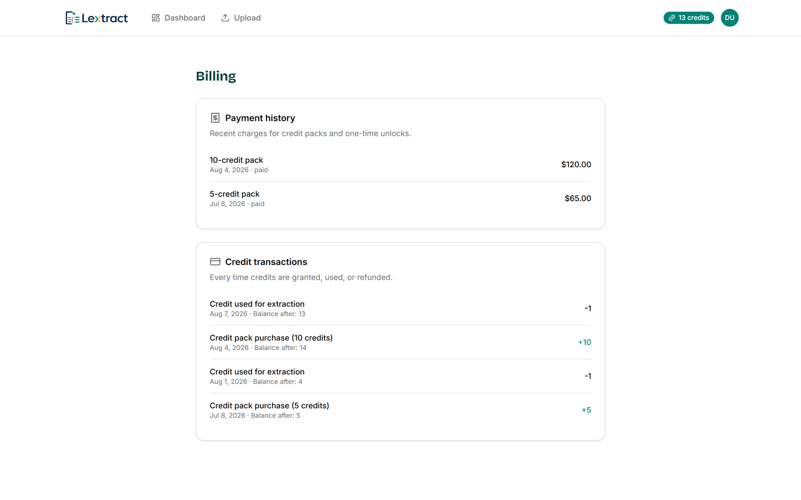

### Idempotency, and picking the right key

The subtle one is credit granting. The duplicate check keys on **whether a ledger row already exists
for this payment**, not on whether the payment row was just created.

That distinction is the difference between self-healing and silent loss. If a webhook delivery
recorded the payment and then crashed before granting credits, keying on payment-creation means the
retry sees "already recorded" and the customer never gets what they paid for. Keying on the ledger
row means the retry completes the job. Because the check runs while holding the user-row lock,
concurrent deliveries for the same user serialise behind it.

Four other mechanisms cover the rest: a `stripe_webhook_events` claim table keyed on the Stripe
event id, a unique constraint on the checkout session with the concurrent-insert race handled on the
insert path, status transitions that report whether they actually applied (so a retry cannot re-send
a completion email), and deterministic export task ids.

### Webhooks distinguish permanent from transient failure

A permanent error (bad data, a conflict, something that will never succeed) records `failed_at`
and `failure_reason` and returns **200**, so Stripe stops retrying. A transient error re-raises for
a 500 so Stripe *does* retry. The event is marked complete only after all side effects succeed, not
before.

Credit amounts come from a hardcoded table, never from Stripe metadata, because metadata is
user-influenceable.

### Access control

RLS models anonymous access rather than punching a hole for it: an anonymous user's extractions are
visible through a subselect matching their session token out of the JWT claims. Ownership violations
return **404, not 403**, so the API never confirms that someone else's extraction exists.

### A cache that cannot go stale

Export files are keyed in R2 by a token derived from the extraction's `updated_at`. Editing a field
bumps `updated_at`, which changes the key, which makes the pre-edit export unreachable. There is no
invalidation call to forget to make.

---

## By the numbers

The code and schema figures below come from [`scripts/repo-metrics.py`](scripts/repo-metrics.py),
which counts only git-tracked files. Run it yourself:

```bash
python scripts/repo-metrics.py
```

<!-- METRICS:START -->
### Code

| Area | Source files | Source lines | Test files | Test lines | Tests |
| --- | ---: | ---: | ---: | ---: | ---: |
| Frontend (Next.js) | 384 | 74,571 | 190 | 35,463 | 2,282 |
| Cloudflare Workers | 43 | 8,390 | 28 | 9,195 | 261 |
| extract-core (TypeScript) | 13 | 1,482 | 7 | 1,304 | 52 |
| extract-sdk (Python, v1) | 27 | 6,823 | 26 | 10,040 | 673 |
| Backend (FastAPI, v1) | 77 | 13,725 | 94 | 34,221 | 1,463 |
| SQL migrations | 23 | 1,170 | 2 | 861 | 0 |
| **Total code** | **567** | **106,161** | **347** | **91,084** | **4,731** |
| Docs & content (md/mdx) | 324 | 55,529 | n/a | n/a | n/a |
| Other tracked code (tooling, vendored) | 8 | 3,046 | n/a | n/a | n/a |

### Extraction schema

- **126 fields** across **16 categories**
- 44 required, 19 CAM-relevant
<!-- METRICS:END -->

### History

This repository is a snapshot, so the numbers below cannot be read out of it. They are measured from
the private development repository as of 2026-08-07, and are stated here rather than generated:

- **1,252 commits** between 2026-03-03 and 2026-08-07, including 201 merges.
- By type: `fix` 421, `chore` 285, `feat` 212, `docs` 67, `test` 26, `refactor` 16.
- Twice as many fixes as features, which is what a single maintainer running the thing in production
  actually spent their time on.

Two things worth pulling out of the table above:

- **Tests very nearly outnumber source, line for line.** That ratio is the single number I would
  look at first in someone else's repository.
- **Roughly half the code is a stack that no longer runs.** `backend/` and `packages/extract-sdk/`
  are v1. They are kept deliberately: see
  [the rewrite](#the-rewrite-python-to-cloudflare-native-and-what-it-cost).

Test counts are static declaration counts. Parameterized cases (`it.each`,
`@pytest.mark.parametrize`) count once here but expand at runtime, so the real totals run higher:
`packages/extract-core` reports 52 above and executes 68. `README.md` is excluded from the docs
count, since it is the report.

File counts differ slightly between this table and the prose below for the same reason: the script's
path pattern also matches files under `tests/` and `__tests__/` directories, which gives 190
frontend test files, while a plain `*.test.*` filename match gives 187. Both figures, and the
full per-area breakdown, are in [`portfolio/METRICS.md`](portfolio/METRICS.md).

`scripts/repo-metrics.py` reads its file list from `git ls-files`, which reflects what is staged,
not the on-disk working tree. The Docs & content row above was verified with a working-tree walk
using the same file-selection and line-counting rules rather than the script's own output, because
this snapshot's single commit had not yet caught up with several already-written `portfolio/`
files at the time this row was last checked; the code and schema rows are unaffected, since neither
depends on which files are staged. `portfolio/METRICS.md` explains this in full.

---

## Testing

The test counts are in the table above, and the frontend suite alone executes 2,282 of them across
190 files (187 under the filename-only count used elsewhere in this document; see
[By the numbers](#by-the-numbers)). The gates are real and they are enforced, but they run
locally, not in CI. There are no GitHub Actions in this repository.

| Suite | Command | Gate |
| --- | --- | --- |
| Backend (Python) | `cd backend && python -m pytest` | `--cov-fail-under=95`, branch coverage |
| Extract SDK (Python) | `cd packages/extract-sdk && python -m pytest` | `--cov-fail-under=95`, branch coverage |
| Frontend | `cd frontend && npx vitest run --coverage` | lines 88 / functions 80 / branches 80.3 / statements 85.6 |
| API Worker | `cd workers/api && npm run check` | typecheck + `wrangler deploy --dry-run` (coverage is reported, not enforced) |

Also enforced: `mypy` strict on both Python packages, TypeScript strict with no `any`, ruff and
black, ESLint.

**The test names are the interesting part.** A large share of files exist to pin one specific bug
that was found once and must never return:

```text
test_field_editor_cas_bug.py          test_credit_race_conditions.py
test_webhook_metadata_bugs.py         test_export_cache_invalidation.py
test_credit_compensating_transactions.py   test_cross_user_isolation.py
test_field_editor_audit_transactional.py   test_migration_security.py
```

**Extraction accuracy has its own harness.** `backend/tests/e2e/ground_truth.py` defines a `Matcher`
hierarchy (`Contains`, `Equals`, `WithinPct`, `IsTruthy`, `AnyOf`) so an assertion can tolerate a
model answering "Triple Net" instead of "NNN", or rounding a figure, without being weakened into
meaninglessness. The fixture corpus is 22 leases drawn from public SEC EDGAR filings; 20 have
ground-truth cases defined. The other two are excluded in a comment explaining why: one is a
Belgian euro-denominated lease, the other a blank template, so no test is generated for them at
all.

> [!WARNING]
> This harness measures `backend/`'s retired Python orchestrator, not the TypeScript
> `packages/extract-core` that was actually serving requests when Lextract retired, and it cannot
> be run out of the box: it needs a paid `OPENROUTER_API_KEY` and a `LEXTRACT_E2E_PDF_DIR` of
> lease PDFs that is not checked into this repository. See
> [portfolio/TESTING.md](portfolio/TESTING.md) for the full breakdown.

There is also `npm run verify:seo`, which regenerates every content index and then
`git diff --exit-code`s them, so stale generated content fails rather than drifting.

---

## Screenshots

All captured from a local production build. `frontend/scripts/capture-archive.mjs` regenerates them,
and sweeps all 618 public routes while it is at it.

### The landing page

Both themes were first-class and the capture sweep shot every page in each, so the image below
follows whichever theme you are reading GitHub in.

<picture>
  <source media="(prefers-color-scheme: dark)" srcset="portfolio/screenshots/hero-desktop-dark.png">
  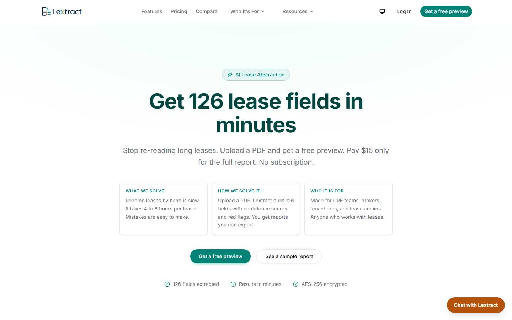
</picture>

### The result preview

What an anonymous user saw before paying: ten of the 126 fields, the confidence distribution across
high, medium, low and not-in-lease, and a red-flag count, with the remaining 116 fields gated behind
an unlock.

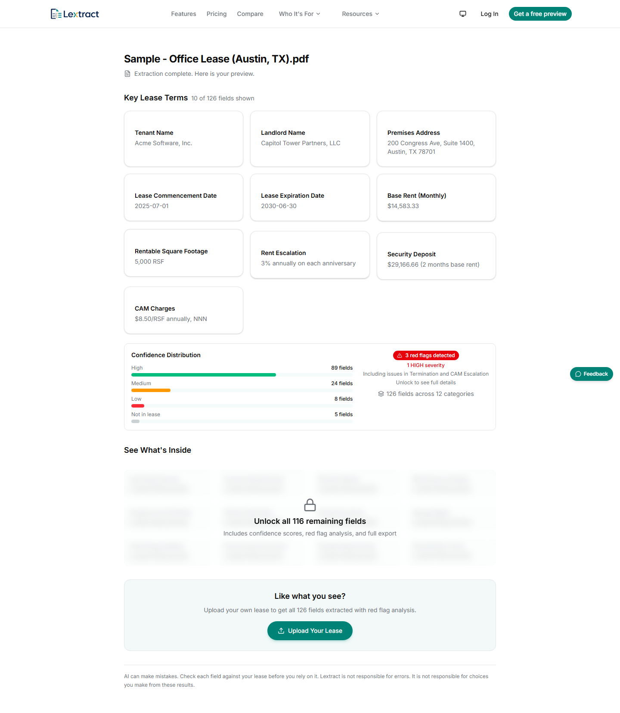

This page is served from a hardcoded fixture, `frontend/lib/sample-extraction.ts`, and that fixture
is wrong in one place: it hardcodes `category_count: 12` where the schema has 16. The rest of the
marketing surface reads the count from `frontend/data/public-knowledge/marketing.ts` and gets 16. It
is a stale literal in demo data rather than anything the extractor did, and it is left as it was
found.

→ [portfolio/DESIGN.md](portfolio/DESIGN.md) is where the type scale, tokens and both
themes were decided

<details>
<summary><b>More screens</b>: the full report, the dashboard, mobile, pricing, upload</summary>

<br>

**The full report.** All 126 fields, grouped by category, each with a confidence rating and the red
flags that came out of the terms. It is one long page, so it renders here as a tall strip; open the
file at full size to read the per-field table.

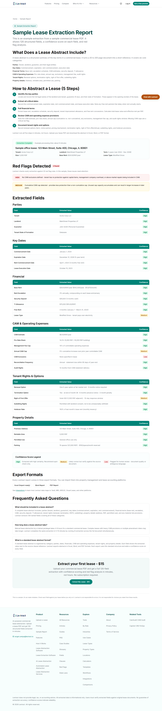

**The dashboard**, on demo data. Four extractions in four different states (uploading, extracting,
failed, complete-and-paid) because the states are the interesting part of the screen.
`scripts/seed-demo.py` seeds five, so this capture is one lease behind the current script.

<picture>
  <source media="(prefers-color-scheme: dark)" srcset="portfolio/screenshots/dashboard-seeded-dark.png">
  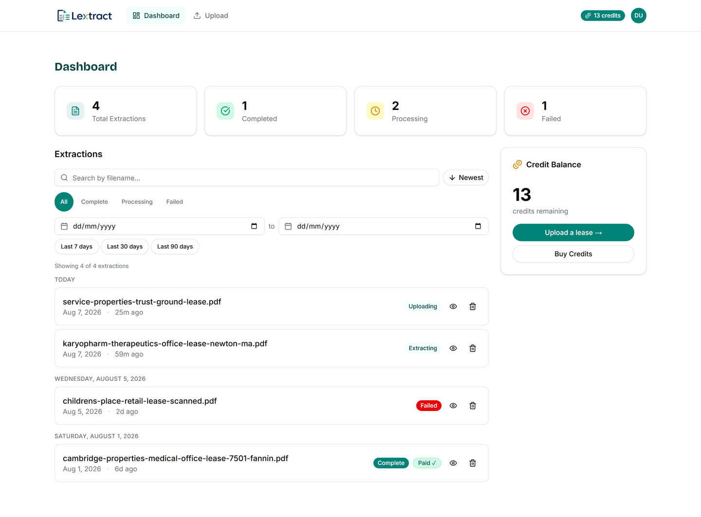
</picture>

**Mobile.**


**Pricing.**

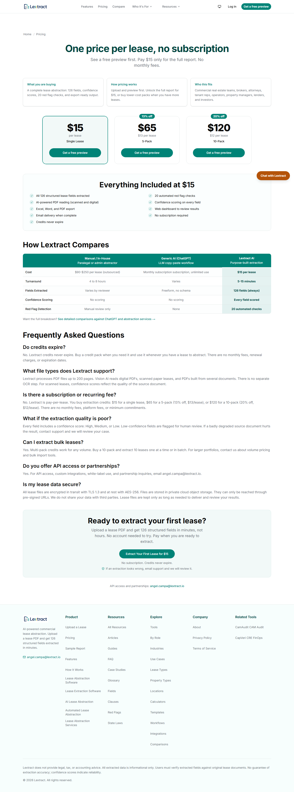

**Upload.**

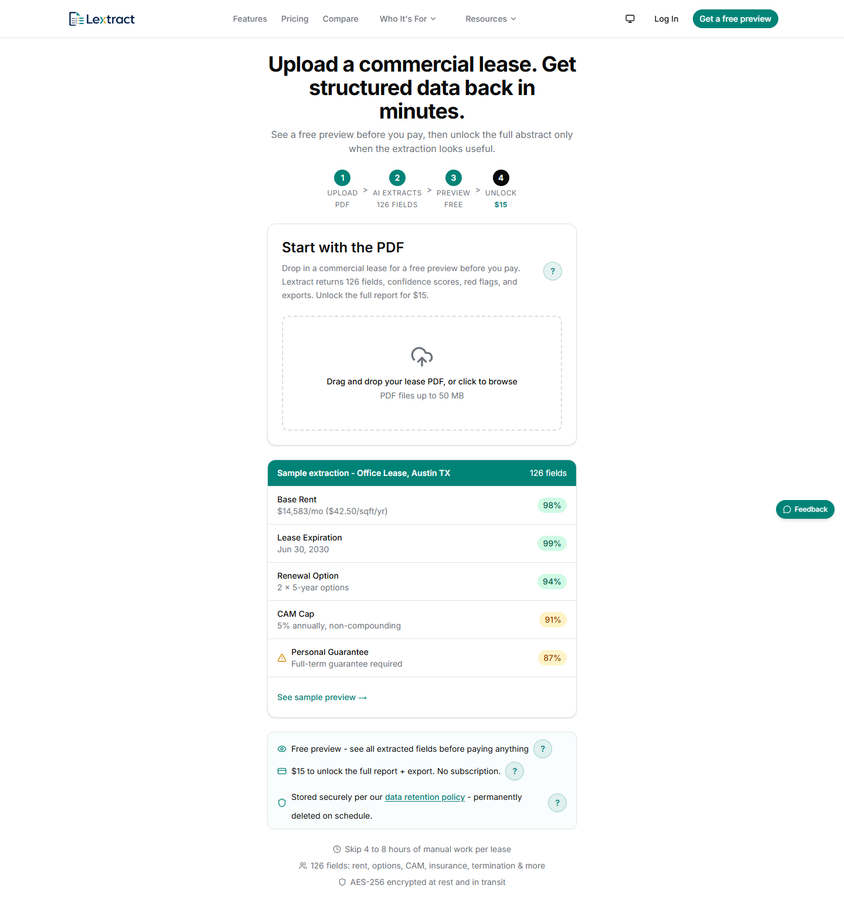

</details>

---

## Repository map

```text
frontend/            Next.js 16 app: marketing site, app shell, lease review UI
  app/(marketing)/     landing, pricing, and the programmatic SEO surface
  app/(app)/           dashboard, billing, profile (auth-gated)
  app/(public-app)/    upload, processing, results (session or anonymous)
  components/results/  the split PDF-and-fields review UI
  lib/seo-inventory.ts the indexable-slug allowlist

workers/
  api/               THE PRODUCTION API: routes, repositories, workflows, queues
  marketing-data/    marketing events on D1

packages/
  extract-core/      extraction domain logic, TypeScript, no Worker bindings
  extract-sdk/       v1 of the same, Python (superseded, not deployed)

backend/             v1 FastAPI + Celery API (superseded, not deployed)
  neon/migrations/   CANONICAL database schema, 17 migrations

portfolio/           The write-ups linked below: architecture, deployment,
                     the PRD, the user flows, the design system
docs/                the working residue: dated E2E bug reports, audit runs,
                     plans, session handoffs, the 126-field schema JSON
scripts/             repo-metrics.py     regenerates the numbers above
                     seed-demo.py        publishable demo data for a local run
                     local-auth-stub.mjs stands in for hosted auth, locally
                     make-snapshot.sh    built this repository, see below
```

Two things that will look wrong until you know why:

- **`backend/` is not deployed, but it owns the schema.** `backend/neon/migrations/` stayed
  canonical through the rewrite because rewriting migration history to move directories would have
  been risk for no benefit.
- **`supabase/` is vestigial.** The project began on Supabase and moved to Neon; two stray
  migrations never got folded in. The RLS policies still carry their ancestry: Supabase's
  `auth.uid()` became `auth.user_id()`, which Neon's Data API provides natively, which is why
  running on plain Postgres needs the shim below.

---

## Documentation

[`portfolio/`](portfolio/) holds the documents written to be read by someone who did not build this:
architecture, product requirements, user flows, deployment, design, security. It is indexed with a
length and a one-line summary per file in [`portfolio/README.md`](portfolio/README.md).
[`docs/`](docs/) holds everything else: dated bug reports, audit runs, plans, and session handoffs,
left in place rather than tidied away, because a repository with no visible working notes is a
repository that was staged.

---

## About this snapshot

This repository has one commit, and that is not laziness: it is the output of
[`scripts/make-snapshot.sh`](scripts/make-snapshot.sh), which is worth reading on its own.

The private working repository had roughly 213 MB of untracked Playwright traces on disk, holding
real production session cookies. The only thing keeping them out of git was `.gitignore`, with no
`.gitattributes` backstop. So the script builds the tree with `git archive` instead of copying
files:

```bash
git archive --format=tar "$REF" | tar -x -C "$DEST_ABS"
```

`git archive` emits the index and nothing else, so an untracked secret cannot reach the snapshot
even if someone edited `.gitignore` or dropped a new one on disk that morning. A `robocopy`, an
`xcopy`, or a zip of the folder would have swept every one of them in. The comment at the top of the
script says exactly that, and says not to "simplify" it into a file copy.

Everything after the copy is an assertion, not advisory output. The script exits non-zero and tells
you not to publish:

- **Exactly one commit.** Anything else means the destination was not clean.
- **File count matches `git ls-tree` on the source ref.** A silent truncation fails the build.
- **No path from a never-ship list:** `.npmrc`, `.env`, `.dev.vars`, and three directories by name.
- **No credential-shaped strings**, matched per provider: the exact base64 header of the production
  auth token, and `sk-or-v1-`, `sk_live_`, `AKIA` prefixes with a 20-character floor of unbroken
  alphanumerics.

That length floor is the part I would point at. This tree is full of fixtures like
`sk_live_prod_key` and `opaque-session-token`, which are the correct thing for a test to contain and
must not fail the build. Requiring twenty characters with no hyphens or underscores excludes every
readable placeholder while still catching the real thing. The script also excludes itself from its
own scan, since it necessarily contains all five patterns as literals.

It adds no remote and pushes nothing. Creating the repository and pushing it were left to a human on
purpose.

---

## Built with AI agents

`CLAUDE.md`, `AGENTS.md`, `.claude/`, and `.codex/` are committed on purpose and reviewed like
source, not scrubbed before publishing. This repository is disclosed, not implied, as an AI-assisted
build.

**The number that survives the squash:** the Cloudflare rewrite (29 commits in the private
development repository, in a single day, against the 1,091-line written plan at
[`docs/superpowers/plans/2026-06-12-cloudflare-native-backend.md`](docs/superpowers/plans/2026-06-12-cloudflare-native-backend.md))
is the one number from the agent-driven part of the process that this squashed, one-commit
snapshot still lets a reader verify: the plan file is right there, and its line count is checkable
with `wc -l`. The 1,252-commit, five-month total in [By the numbers](#by-the-numbers) is broader
context, not an AI-specific figure: most of it predates any agent workflow.

**What the process actually enforced, not just used:** the plan itself names a required sub-skill,
`superpowers:subagent-driven-development`, so the agents executing it worked task-by-task against
the plan's checkboxes rather than free-running. Before any branch merged to master,
[`.claude/skills/review-merge/SKILL.md`](.claude/skills/review-merge/SKILL.md) required a separate
code-reviewer subagent pass over the full diff, flagging critical bugs, logic errors, security
issues, type errors, test gaps, and `CLAUDE.md` convention violations, before the merge step was
allowed to run. Underneath that sits the gate stated plainly in [Testing](#testing):
`--cov-fail-under=95` on both Python packages, mypy strict, and TypeScript strict with no `any`,
none of which is theatre: they ran locally on every change, agent-authored or not, and are the
reason the test suite in [By the numbers](#by-the-numbers) very nearly outnumbers the source it
tests.

---

## Running it locally

Requires Node 22+, Python 3.12+, and Docker.

```bash
# 1. Infrastructure: Postgres and an S3-compatible store
docker compose -f backend/docker-compose.yml -f backend/docker-compose.local.yml \
  up -d postgres minio

# 2. Schema. The shim first: Neon's Data API provides the `auth` schema and
#    auth.user_id() natively, so the RLS migrations reference them without
#    creating them. Plain Postgres needs a stand-in.
psql "$LOCAL_DATABASE_URL" -f backend/neon/local/00000_local_auth_shim.sql
for f in backend/neon/migrations/*.sql; do psql "$LOCAL_DATABASE_URL" -f "$f"; done

# 3. Frontend
cd frontend && npm install && npm run dev
```

The marketing site, `/sample-report`, and `/results/sample` all render with no backend at all.
`/results/sample` is served from a hardcoded fixture specifically so the review UI can be seen
without an account.

### The signed-in app, with no hosted services

Auth in production was a thin proxy in front of a single contract,
`GET {NEON_AUTH_BASE_URL}/get-session`. So one local stand-in for that endpoint is enough to run the
whole authenticated app offline.

The seed script needs one package the frontend steps above do not: `pip install "psycopg[binary]"`,
or `cd backend && pip install -e .` if you want the whole v1 environment.

Terminal 1: seed, then run the stub. It stays in the foreground.

```bash
# A user with a credit balance, five extractions in mixed states, an
# append-only credit ledger, and one fully populated 126-field result.
python scripts/seed-demo.py

export DEMO_USER_ID=...   # paste the uuid the seed script printed
node scripts/local-auth-stub.mjs
```

Terminal 2: the API worker.

```bash
cp workers/api/.dev.vars.example workers/api/.dev.vars
cd workers/api && npx wrangler dev -c wrangler.dev.jsonc
```

Point `NEON_AUTH_BASE_URL` at `http://localhost:4000` in both `frontend/.env.local` and
`workers/api/.dev.vars`, and leave `NEON_AUTH_JWKS_URL` unset. The bearer path then throws
immediately and the session-token path takes over, which is the one the stub answers. No JWKS
server, no key material, no signing.

The stub authenticates every request it receives. It exists so the app can be run, and it binds to
loopback for that reason. It is not a component of the deployed system.

The seeded lease data is quoted verbatim from the SEC EDGAR filings in
`packages/extract-sdk/tests/fixtures/real-leases/`, down to the `source_text` on each field. Two
values are the exception: a commencement date and a CAM audit deadline that the filings imply
rather than state. Both are marked `DERIVED` in `scripts/seed-demo.py` and seeded below the
low-confidence threshold, which is how a real extraction would report a value it had to infer.
Nothing else is invented, and no real customer data exists anywhere in this repository.

**`@ventora/ai-cs` will not install for you.** It is the in-app support widget, it lives on a
private registry, and it is declared as an optional dependency. `npm install` succeeds without it
and the widget falls back to a no-op in `frontend/components/ai-cs/vendor-stub.tsx`. Nothing else is
affected.

To regenerate the screenshot archive against a running server:

```bash
cd frontend
npm install --no-save playwright && npx playwright install chromium
node scripts/capture-archive.mjs
```

---

## Who built this

Lextract was designed, built, deployed and operated by one person. The schema, the extraction
pipeline, the Workers, the frontend, the SEO surface, the migrations and the tests are all mine, and
so is every decision above that I would now make differently.

Angel Campa · [github.com/AngelCampa1](https://github.com/AngelCampa1)

Questions about anything in here are welcome, including the parts I got wrong.

---

## License

Copyright © 2026 Angel Campa. All rights reserved. This code is published for reading and evaluation
only: see [LICENSE](LICENSE) and [NOTICE](NOTICE).
